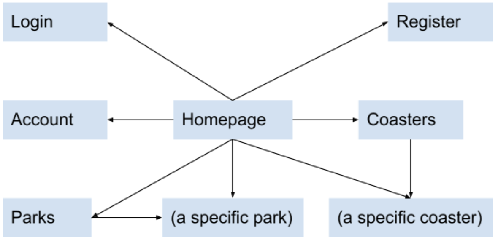

# Coaster Reviews

## Overview

The world is full of magical theme parks and roller coasters, with more popping up each year. This is exciting, until one is faced with the task of planning a vacation to one of these destinations. Thanks to the paradox of choice, deciding which park(s) to visit can be quite stressful. This site serves to aid financially constrained theme park/coaster enthusiasts in deciding where to spend their hard earned bucks.

Coaster Reviews is a web app that allows users to review and read reviews of roller coasters from around the world. Users can register and login. Anyone can read reviews, but only logged in users can post new reviews.


## Data Model

The app will store Users, Parks, Coasters, and Reviews. Parks and Coasters will be displayed with a rating between 1 and 5. Coaster ratings are calculated with the average rating of its reviews. Park ratings are calculated with the average rating of its Coasters. Coaster and park ratings are not stored explicitly but are calculated each time they are rendered.

Sample User:

```javascript
{
  type: admin // could also be 'user' (less privileged)
  username: “garrettlu”,
  password: // a salted & hashed password
}
```

Sample Review:

```javascript
{
  author: // a reference to a User document
  postTime: // stores the time the review was posted
  rating: 5,
  body: “Great, would ride again”
}
```

Sample Coaster:

```javascript
{
  name: “Superman The Ride”,
  reviews: // a list of references to Review documents
  slug: // a unique slug
}
```

Sample Park:

```javascript
{
  name: “Six Flags New England”,
  location: "Agawam, Massachusetts, USA",
  coasters: // a list of references to Coaster documents
  slug: // a unique slug
}
```


## [Link to Commented First Draft Schema](db.js) 


## Wireframes

Common header:


/ - homepage; displays a few highly rated parks and coasters


/login - login page


/register - registration page


/parks - page for displaying all parks


/coasters - page for displaying all coasters (same wireframe as above)

/:park - page for displaying a specific park and its coasters


/:park/:coaster - page for displaying a specific coaster and its reviews


/account - page for displaying a user's account information and reviews posted by the user


## Site Map




## Use Cases

1. As a non-logged in user, I can register an account on the site
2. As a non-logged in user, I can log in to the site
3. As a non-logged in user, I can view parks, coasters, and reviews on the site
4. As a logged-in user, I can do (3), as well as post and delete own reviews, and log out of the site
5. As a logged-in admin, I can do (4), as well as delete all reviews, and add/edit parks and coasters


## Research Topics

* (3 points) Authentication
  * Candidates: Passport
  * In order to support user accounts and role based authorization, There needs to be a way to securely store and retrieve sensitive user information. I will use Passport to integrate username/password authentication in the app.
* (3 points) Configuration management
  * Candidates: nconf, Node convict
  * It is often the case that the app's behavior needs to be modified to suit its production environment, such as disabling logging and connecting to different databases. I will use a library to help me manage development and production configurations.
* (1 point) Slug generation for routing
  * Candidates: Mongoose slug generator, slugify
  * The site will potentially have many parks and coasters. It would be convenient to automatically generate a slug whenever a new park or coaster is added. I will use a library to generate slugs for each new park and coaster.
* (1 point) Messages displayed on redirect
  * Candidates: Connect flash
  * When browsing a website, various errors may occur. It would be helpful to the user to know whether or not a redirect heppened due to an error. I will use a library to help me store and retrieve appropriate messages upon each redirect.
* (4 points, estimated) Front end framework (time permitting)
  * Candidates: React, Vue, Angular
  * These frameworks provide powerful methods for creating and managing user interfaces. I will use a framework to handle site presentation and user interactivity such as sorting, filtering, posting/deleting reviews, etc.

Total points: 8 (12 if time permitting)


## [Link to Initial Main Project File](app.js) 


## Annotations / References Used

### Research topics

1. [docs on Passport](http://www.passportjs.org/docs/)
  * [source code 1](https://github.com/nyu-csci-ua-0467-001-fall-2021/gbl254-final-project/blob/9971f39938248aaef7829707f40f2f7dd366a367/auth.js#L22-L30)
  * [source code 2](https://github.com/nyu-csci-ua-0467-001-fall-2021/gbl254-final-project/blob/9971f39938248aaef7829707f40f2f7dd366a367/auth.js#L70-L71)
  * [source code 3](https://github.com/nyu-csci-ua-0467-001-fall-2021/gbl254-final-project/blob/66e9ef20cc412da91303338da8ac15a08eb72302/app.js#L79-L83)
2. [docs on Node convict](https://www.npmjs.com/package/convict)
  * [source code 1](https://github.com/nyu-csci-ua-0467-001-fall-2021/gbl254-final-project/blob/acb4f4223f109be4b6e72274db48e083d86f94df/app.js#L28)
  * [source code 2](https://github.com/nyu-csci-ua-0467-001-fall-2021/gbl254-final-project/blob/acb4f4223f109be4b6e72274db48e083d86f94df/db.js#L244-L246)
  * [example config schema](https://github.com/nyu-csci-ua-0467-001-fall-2021/gbl254-final-project/blob/master/config-schema.js.example)
  * [example config](https://github.com/nyu-csci-ua-0467-001-fall-2021/gbl254-final-project/blob/master/config.json.example)
3. [docs on Mongoose slug generator](https://www.npmjs.com/package/mongoose-slug-generator)
  * [source code 1](https://github.com/nyu-csci-ua-0467-001-fall-2021/gbl254-final-project/blob/9971f39938248aaef7829707f40f2f7dd366a367/db.js#L7)
  * [source code 2](https://github.com/nyu-csci-ua-0467-001-fall-2021/gbl254-final-project/blob/9971f39938248aaef7829707f40f2f7dd366a367/db.js#L84-L88)
4. [docs on Connect flash](https://www.npmjs.com/package/connect-flash)
  * [source code 1](https://github.com/nyu-csci-ua-0467-001-fall-2021/gbl254-final-project/blob/9971f39938248aaef7829707f40f2f7dd366a367/app.js#L45)
  * [source code 2](https://github.com/nyu-csci-ua-0467-001-fall-2021/gbl254-final-project/blob/9971f39938248aaef7829707f40f2f7dd366a367/app.js#L56)

### Other

1. [docs on Mongoose unique validator](https://www.npmjs.com/package/mongoose-unique-validator)
  * [source code 1](https://github.com/nyu-csci-ua-0467-001-fall-2021/gbl254-final-project/blob/9971f39938248aaef7829707f40f2f7dd366a367/db.js#L30)
  * [source code 2](https://github.com/nyu-csci-ua-0467-001-fall-2021/gbl254-final-project/blob/9971f39938248aaef7829707f40f2f7dd366a367/db.js#L41)
2. [docs on Mongoose autopopulate](https://www.npmjs.com/package/mongoose-autopopulate)
  * [source code 1](https://github.com/nyu-csci-ua-0467-001-fall-2021/gbl254-final-project/blob/9971f39938248aaef7829707f40f2f7dd366a367/db.js#L52)
  * [source code 2](https://github.com/nyu-csci-ua-0467-001-fall-2021/gbl254-final-project/blob/9971f39938248aaef7829707f40f2f7dd366a367/db.js#L67)